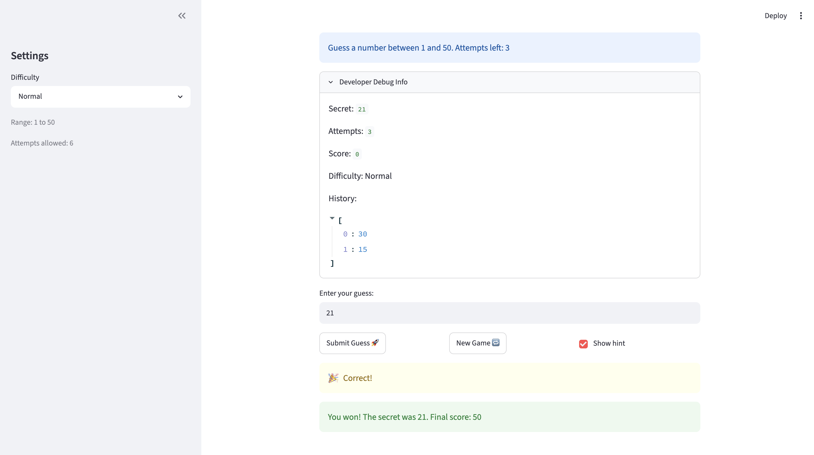

# 🎮 Game Glitch Investigator: The Impossible Guesser

## 🚨 The Situation

You asked an AI to build a simple "Number Guessing Game" using Streamlit.
It wrote the code, ran away, and now the game is unplayable. 

- You can't win.
- The hints lie to you.
- The secret number seems to have commitment issues.

## 🛠️ Setup

1. Install dependencies: `pip install -r requirements.txt`
2. Run the broken app: `python -m streamlit run app.py`

## 🕵️‍♂️ Your Mission

1. **Play the game.** Open the "Developer Debug Info" tab in the app to see the secret number. Try to win.
2. **Find the State Bug.** Why does the secret number change every time you click "Submit"? Ask ChatGPT: *"How do I keep a variable from resetting in Streamlit when I click a button?"*
3. **Fix the Logic.** The hints ("Higher/Lower") are wrong. Fix them.
4. **Refactor & Test.** - Move the logic into `logic_utils.py`.
   - Run `pytest` in your terminal.
   - Keep fixing until all tests pass!

## 📝 Document Your Experience

### Describe the game's purpose.

It's a **number guessing game** built with Streamlit. The app picks a secret number within a range that depends on the chosen difficulty (Easy `1–20`, Normal `1–50`, Hard `1–100`). The player types a guess and submits it; the game responds with a hint — **"Go HIGHER!"** or **"Go LOWER!"** — until they find the secret. Each player has a limited number of attempts (Easy 8, Normal 6, Hard 5), a running score, and a history of past guesses. The goal is to identify the secret number in as few attempts as possible.

### Detail which bugs you found.

All of these bugs lived in the original `app.py`:

1. **Secret number reset on every click (state bug).** `secret_number = random.randint(1, 100)` ran on every rerun, so Streamlit picked a *new* secret every time the player clicked "Submit." The number could never be guessed — the game was unwinnable.
2. **Inverted hints.** When the guess was *higher* than the secret the app said "Go HIGHER!", and when it was *lower* it said "Go LOWER!" — both backwards. The hints actively led the player away from the answer.
3. **Attempt counter burned by invalid input.** Empty, whitespace-only, or non-numeric input still advanced the game state / would count as a turn instead of being rejected cleanly.
4. **Out-of-range guesses accepted.** A guess outside the valid range (e.g. `500` in Easy mode) was treated as a normal guess instead of being rejected.
5. **Stale secret after a difficulty change.** Switching difficulty mid-game changed the range but kept the old secret, so a Hard secret like `80` could survive a switch to Easy (`1–20`) — making that round impossible to win.
6. **Difficulty ranges / attempt limits unbalanced** and game logic was crammed inline in `app.py`, untested and hard to verify.

### Explain what fixes you applied.

**In `app.py`:**
- Stored the secret in `st.session_state.secret` (created once with `if "secret" not in st.session_state`) so it persists across reruns instead of regenerating on every click.
- Added persistent session state for `attempts`, `score`, `status`, and `history`.
- Only increment the attempt counter on a *valid* guess; invalid input shows an error and does not count.
- Reject out-of-range guesses with `elif guess_int < low or guess_int > high:` before scoring.
- Regenerate the secret (and reset the round) when the difficulty changes mid-game via `regenerate_secret(difficulty)`.
- Balanced the attempt limits per difficulty and surfaced the range / attempts-left to the player.

**In `logic_utils.py`:**
- Refactored the guess comparison into `check_guess()` with the hints **corrected**: `guess > secret` → "📉 Go LOWER!", `guess < secret` → "📈 Go HIGHER!", equal → "🎉 Correct!".
- Added `parse_guess()` to validate input (rejects `None`, empty/whitespace, and non-numeric values) and return a clean `(ok, value, error)` tuple.
- Added `get_range_for_difficulty()` and `regenerate_secret()` so ranges are defined in one place and the secret can be re-rolled within the correct range.
- Moved scoring into `update_score()`.
- All of this logic is now covered by `tests/test_game_logic.py` (13 passing tests).

## 📸 Demo Walkthrough

Describe your fixed game in numbered steps so a reader can follow along without watching a video:

1. User submits a guess of 30
2. Game returns "📉Go LOWER!"
3. User enters a guess of 15 → "📈Go HIGHER!"
4. Score updates correctly after each guess
5. Game ends after the correct guess

**Screenshot** *(optional)*: <!-- Insert a screenshot of your fixed, winning game here -->

## 🧪 Test Results

```
# Paste your pytest output here, e.g.:
rootdir: /Users/tdo/Desktop/AI110/ai110-module1show-gameglitchinvestigator-starter/tests
plugins: Faker-18.13.0, anyio-4.13.0
collected 22 items                                                                                                                                                  

test_game_logic.py ......................                                                                                                                     [100%]

======================================================================== 22 passed in 0.03s =========================================================================
```

## 🚀 Stretch Features

- [ ] [If you choose to complete Challenge 4, describe the Enhanced UI changes here — a screenshot is optional]
